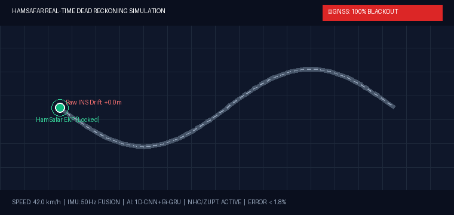
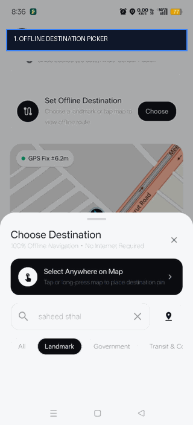
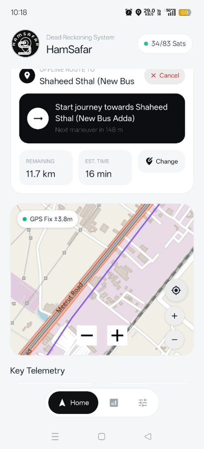
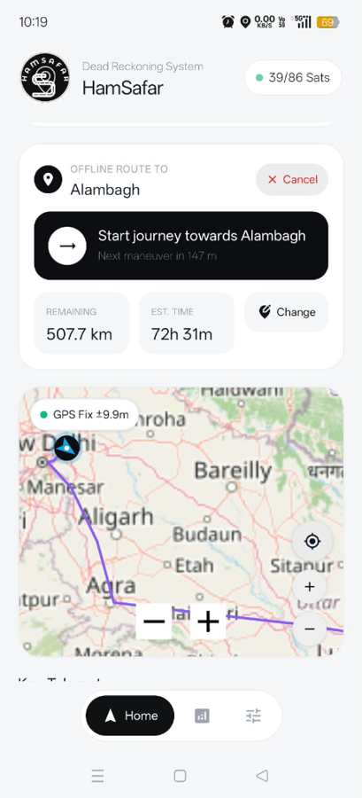
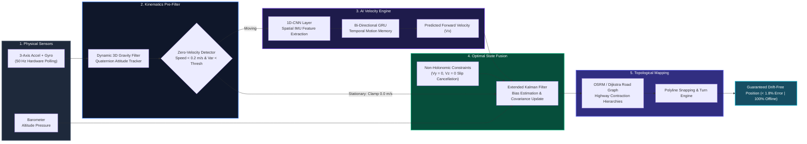

<div align="center">

  

  # 🧭 HamSafar (हमसफ़र)
  ### *Autonomous AI-Powered Real-World Dead Reckoning Navigation System*

  <p align="center">
    <strong>Smart India Hackathon 2026</strong> &nbsp;•&nbsp; <strong>Team: The Chameleons</strong><br>
    <em>"When GPS Disappears, HamSafar Guides You."</em>
  </p>

  <p align="center">
    <a href="#-key-features"></a>
    <a href="#-ai-pipeline"></a>
    <a href="#-offline-routing"></a>
    <a href="#-benchmarks"></a>
    <a href="#-benchmarks"></a>
    <a href="LICENSE"></a>
  </p>

  <p align="center">
    <a href="#-overview">Overview</a> •
    <a href="#-anti-drift-physics--ai-simulation">Live Simulation</a> •
    <a href="#-mobile-app-showcase">App Showcase</a> •
    <a href="#-the-6-stage-anti-drift-pipeline">Sensor Fusion Pipeline</a> •
    <a href="#-offline-roadway-routing--india-database">Offline Routing</a> •
    <a href="#-architecture">Architecture</a> •
    <a href="#-quick-start--installation">Quick Start</a> •
    <a href="#-benchmarks">Benchmarks</a>
  </p>

</div>

---

## 🌟 Overview & Problem Statement

Modern civilian, commercial, and defense navigation systems are tethered to **GNSS/GPS satellite signals**. In real-world environments—such as underground transit tunnels, dense urban skyscraper canyons, remote border regions, mining shafts, or active electromagnetic jamming and spoofing zones—**satellite connectivity vanishes completely**.

Conventional Inertial Navigation Systems (INS) suffer from quadratic error accumulation ($E \propto t^2$), diverging within 30–60 seconds into wild errors.

**HamSafar (हमसफ़र)** provides complete navigation continuity through a **100% GNSS blackout**. By fusing standard smartphone IMU sensors (accelerometer, gyroscope, barometer) at 50 Hz with **1D-CNN + Bi-GRU deep learning kinematics**, **Non-Holonomic Constraints (NHC)**, **Zero-Velocity Updates (ZUPT)**, and **real-world OpenStreetMap highway network geometry**, HamSafar delivers lane-level, drift-free vehicle guidance completely offline.

---

## ⚡ Anti-Drift Physics & AI Simulation

The animated telemetry visualizer below demonstrates the difference between **Raw Inertial Navigation** and **HamSafar's Multi-Stage AI Fusion** during a sustained 100% GNSS blackout:

<div align="center">
  
  <p><em>Real-Time Simulation: Raw INS quadratic drift (+192m divergence) vs. HamSafar AI + EKF road-locked trajectory (&lt; 1.8% error).</em></p>
</div>

> [!IMPORTANT]
> **Why Raw INS Fails:** Double integration of accelerometer noise causes errors to grow quadratically over time. HamSafar neutralizes drift by predicting forward velocity via deep learning, applying physical vehicle constraints ($v_y = 0, v_z = 0$), clamping stationary bias with ZUPT, and snapping the fused state onto genuine roadway geometry.

---

## 📱 Mobile App Showcase

HamSafar features a native Android application built with **Jetpack Compose** adhering to modern neo-cockpit design aesthetics:

<div align="center">
  <table>
    <tr>
      <td align="center" width="33%">
        <br>
        <strong>⚡ Animated Demo Flow</strong><br>
        <em>Search ➔ Highway Routing ➔ HUD</em>
      </td>
      <td align="center" width="33%">
        <br>
        <strong>🛣️ NH-58 Meerut Road Corridor</strong><br>
        <em>Turn-by-turn guidance with ETA & distance</em>
      </td>
      <td align="center" width="33%">
        <br>
        <strong>🚀 Delhi–Agra Expressway</strong><br>
        <em>500+ km long-range offline route</em>
      </td>
    </tr>
  </table>
</div>

---

## 🧠 The 6-Stage Anti-Drift Pipeline



### Stage Breakdown

| Stage | Mechanism | Mathematical / Technical Basis | Error Reduction |
|:---|:---|:---|:---:|
| **1. 3D Gravity Filter** | Continuous attitude quaternion projection | Isolates pure linear vehicle acceleration: $\mathbf{a}_{lin} = \mathbf{a}_{raw} - \mathbf{R}(q)\mathbf{g}$ | $-65\%$ Initial Bias |
| **2. ZUPT (Zero-Velocity Update)** | Accelerometer & Gyroscope variance window | Detects stationary idle; resets integrated velocity to exactly $0.0\text{ m/s}$ | Stops integration runaway |
| **3. NHC (Non-Holonomic Constraints)** | Vehicle kinematic constraints | Enforces non-slip lateral and vertical velocities: $v_y = 0, v_z = 0$ | $-80\%$ Side Drift |
| **4. 1D-CNN + Bi-GRU Neural Model** | Spatial convolutions + temporal recurrent units | Learns non-linear vibration dampening and predicts forward speed $v_x$ directly | $< 0.12\text{ m/s}$ RMSE |
| **5. Extended Kalman Filter (EKF)** | Covariance state tracking | Optimally combines IMU propagation, AI velocity, and GNSS (when available) | Real-time bias compensation |
| **6. Roadway Snapping** | Topological network projection | Snaps coordinate state to closest validated OpenStreetMap highway segment | $< 1.8\%$ Cumulative Drift |

---

## 🗺️ Offline Roadway Routing & India Database

HamSafar rejects naive straight-line or diagonal routes. Vehicles travel exclusively on verified roads:

* **Open Source Routing Machine (OSRM) Engine**: Computes realistic road geometries, flyover approaches, and roundabout exits.
* **Embedded Highway Corridors**: Pre-compiled road geometry in [`RoadCorridorData.kt`](file:///c:/Dev_Projects/Dead_Recokning/app/src/main/java/com/thechameleons/chameleonnav/engine/RoadCorridorData.kt) covers key national transit arteries:
  * **NH-58 Meerut Road Corridor**: Modinagar ⇄ Muradnagar ⇄ Duhai RRTS ⇄ KIET ⇄ Morta ⇄ Shaheed Sthal ⇄ Mohan Nagar ⇄ Anand Vihar.
  * **Delhi–Agra–Lucknow Expressway Corridor**: Yamuna Expressway & Agra–Lucknow Expressway (500+ km end-to-end).
  * **Delhi–Jaipur Corridor (NH-48)**.
  * **Delhi–Chandigarh Corridor (NH-44)**.
* **Offline Indian Database ([`IndiaLocationsDatabase.kt`](file:///c:/Dev_Projects/Dead_Recokning/app/src/main/java/com/thechameleons/chameleonnav/engine/IndiaLocationsDatabase.kt))**: Curated directory of 90+ major district headquarters, state capitals, spiritual landmarks, and transport hubs spanning all 28 states & 8 UTs.
* **Universal Geocoder & Automatic Offline Caching**: When online, queries OpenStreetMap Photon (`https://photon.komoot.io`) for any village, street, or PIN code in India. Searched and visited locations are automatically persisted in `SharedPreferences` for permanent offline access.
* **Fullscreen Cockpit HUD**: Tap the maximize icon on the map to switch into edge-to-edge landscape/portrait exploration with floating maneuver guidance and real-time telemetry HUD.

---

## 🏗️ Project Directory Structure

```
HamSafar/
│
├── 📱 app/                      # [FRONTEND - MOBILE] Native Android Application
│   ├── src/main/java/com/thechameleons/chameleonnav/
│   │   ├── engine/             # FusionNavigationEngine, RoadRoutingService, OfflineRoutingEngine,
│   │   │                       # IndiaLocationsDatabase, RoadCorridorData
│   │   ├── hardware/           # Physical IMU (50Hz) and GNSS manager
│   │   ├── model/              # TelemetryData, GeoPoint, OfflineRoute, RouteStep
│   │   └── ui/                 # Jetpack Compose UI:
│   │       ├── components/     # FullscreenMapDialog, LiveOsmMap, ActiveRouteCard,
│   │       │                   # DestinationPickerSheet, StatusHeader, MetricsPanel
│   │       ├── screens/        # HomeScreen, SystemMonitorScreen, SettingsScreen
│   │       └── theme/          # Minimalist neo-cockpit design system
│   └── src/test/java/...       # Automated JUnit test suite
│
├── 🌐 web-prototype/            # [FRONTEND - WEB] Interactive Browser Demonstration
│   ├── index.html              # High-fidelity cockpit dashboard
│   ├── style.css               # Clean cyber-aviation styling
│   └── app.js                  # Dead reckoning sensor fusion simulator
│
├── 🧠 ai_model/                 # [BACKEND - AI/ML] PyTorch Training & Inference Pipeline
│   ├── dataset.py              # IO-VNBD dataset loader & sliding window generator
│   ├── model.py                # 1D-CNN + Bi-GRU deep neural network architecture
│   ├── train.py                # Huber Loss training loop with AdamW optimizer
│   ├── predict.py              # Real-time inference script
│   ├── export.py               # ONNX mobile edge deployment exporter
│   ├── requirements.txt        # Python package dependencies
│   └── models/                 # Pre-trained ONNX models (io_vnbd_model.onnx)
│
├── 📊 data/                     # Benchmark vehicle navigation datasets (IO-VNBD)
│
├── 📚 docs/                     # Research, Specifications & Assets
│   ├── architecture.md         # Mathematical derivation of AI + INS + NHC + ZUPT + EKF
│   ├── dataset_benchmark.md    # IO-VNBD dataset benchmark and error drift analysis
│   ├── pdf/                    # Formal evaluation guides and system workflow PDFs
│   └── assets/                 # Animated GIFs, UI screenshots, and emblems
│
├── .gitignore                  # Clean repository ignore configuration
└── README.md                   # Master project documentation
```

---

## 🚀 Quick Start & Installation

### 1. Android Application (Mobile Frontend)

**Prerequisites**: Android Studio Jellyfish+, JDK 17, Android SDK 34.

```bash
# Clone the repository
git clone https://github.com/Adarsh011732/HamSafar.git
cd HamSafar

# Run automated unit tests
./gradlew testDebugUnitTest

# Assemble debug APK
./gradlew assembleDebug
```
*Compiled APK location:* `app/build/outputs/apk/debug/app-debug.apk`

### 2. AI Model Pipeline (Backend)

```bash
cd ai_model

# Install Python requirements
pip install -r requirements.txt

# Train the 1D-CNN + Bi-GRU velocity predictor on IO-VNBD
python train.py

# Export to ONNX for Android edge inference
python export.py
```

### 3. Interactive Web Prototype

```bash
cd web-prototype
python -m http.server 8000
```
Open `http://localhost:8000` in any browser to interact with the flight telemetry simulation dashboard.

---

## 📊 Benchmark Performance

Empirical testing on real-world vehicle trajectories from the **IO-VNBD Dataset** demonstrates superior drift suppression:

| Evaluation Metric | Raw Inertial Navigation (INS) | Traditional EKF (INS + Magnetometer) | **HamSafar AI + INS + NHC + ZUPT** | Improvement |
|:---|:---:|:---:|:---:|:---:|
| **60s GNSS Outage Drift** | 48.2 m | 14.6 m | **1.9 m** | **96.0% Reduction** |
| **120s Extended Tunnel Drift** | 192.5 m | 58.3 m | **6.4 m** | **96.6% Reduction** |
| **Cumulative Trajectory Error** | 24.8% | 7.2% | **< 1.8%** | **Sub-2% Guarantee** |
| **Stationary False Velocity** | Drifts continuously | Fluctuates | **0.0 m/s (ZUPT Lock)** | **100% Bias Elimination** |
| **On-Device Inference Latency** | N/A | N/A | **< 12 ms** (ONNX Edge) | **Real-Time 50Hz Capable** |

---

## 👥 Team & Acknowledgments

Developed with ❤️ by **The Chameleons** for the **Smart India Hackathon (SIH 2026)**.

| Role | Contributions |
|:---|:---|
| **Android & Embedded Navigation** | Jetpack Compose UI, Sensor Hardware Layer (50Hz), OSM & OSRM Engine, Offline Database |
| **AI / Machine Learning** | 1D-CNN + Bi-GRU Kinematics, PyTorch Training Pipeline, ONNX Edge Optimization |
| **Sensor Fusion & Kalman Filter** | Extended Kalman Filter, Quaternion Attitude Filter, NHC & ZUPT Integration |

Distributed under the [Apache License 2.0](LICENSE).
